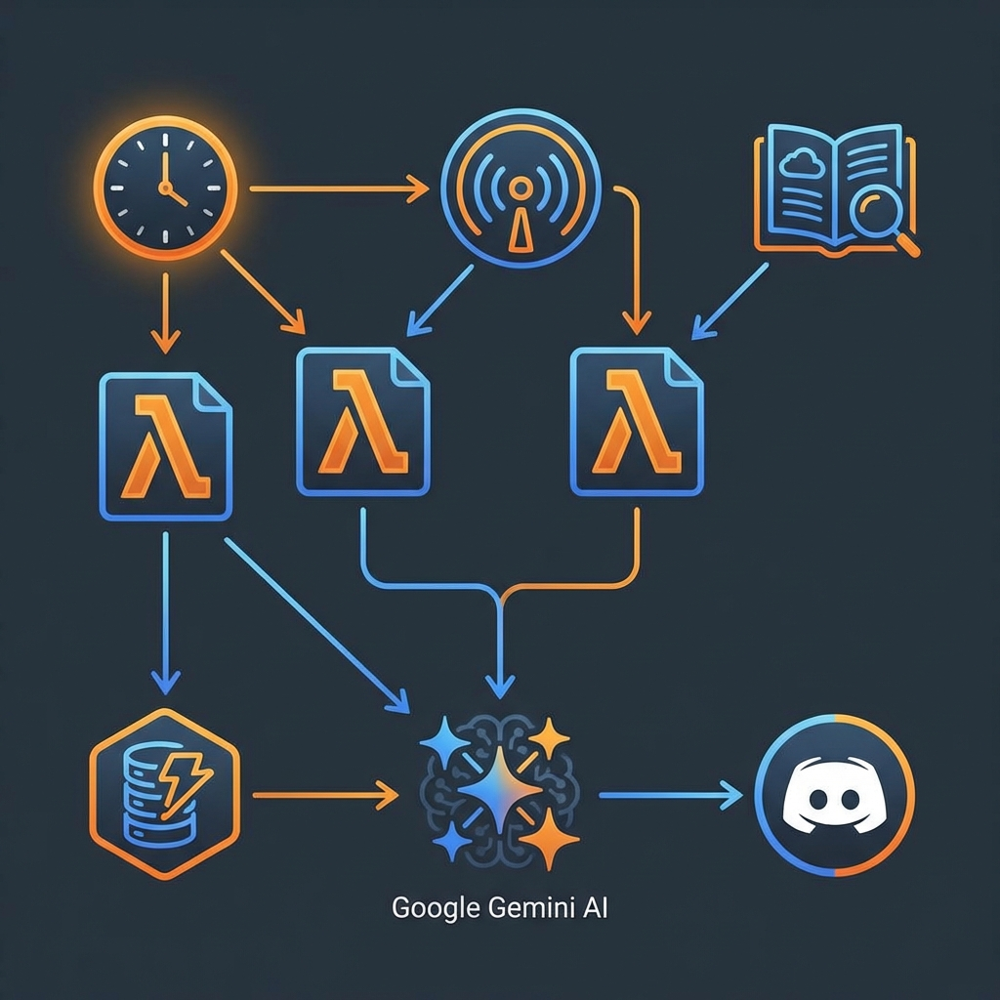

# 🎓 AWS Masterclass AI: Smart News & Architect Bot

A serverless, AI-powered automation system that delivers high-quality AWS technical news and architectural deep-dives directly to your Discord channel. 

Built for DevOps, SREs, and Cloud Engineers who want to master AWS without drowning in documentation.

## 🚀 How it Works

The system consists of two specialized bots powered by **Google Gemini 1.5 Flash**:

### 1. 📰 The Smart News Bot
- **Source**: Fresh official updates from the AWS "What's New" RSS feed.
- **Deduplication**: Uses **Amazon DynamoDB** to ensure you never see the same announcement twice.
- **AI Insight**: Not just a link! Gemini analyzes the announcement to provide:
  - **⚙️ DevOps Impact**: How this affects production infra or workflows.
  - **💡 Key Takeaway**: The #1 technical "pro-tip" to remember.
  - **🚀 Recommendation**: A blunt "Yes/No" on whether to prioritize this update.

### 2. 🎓 The Senior Knowledge Bot
- **Source**: Directly scrapes official AWS Product & Documentation pages.
- **Masterclass Delivery**: Cycles through 100+ AWS services to deliver an expert-level breakdown.
- **DevOps Pro-Tips**: Real-world "gotchas" and configuration advice from a Senior Architect perspective.
- **Cloud Battle**: Direct architectural comparisons with **Azure** and **GCP** equivalents.

## 🛠️ Tech Stack
- **Language**: Python 3.9 (Lambda)
- **Infrastructure**: Terraform (IaC)
- **Compute**: AWS Lambda (Serverless)
- **Database**: Amazon DynamoDB
- **AI Engine**: Google Gemini 1.5 Flash (via API)
- **Delivery**: Discord Webhooks

## 📊 Strengths & Limitations

### Strengths
- **Low Cost**: Operates entirely within AWS Free Tier (Lambda/DynamoDB) and uses the free Gemini API tier.
- **Zero Maintenance**: Fully serverless; no servers to patch or manage.
- **High Signal-to-Noise**: Filters marketing fluff to focus on technical "must-knows."
- **Comprehensive**: Supports scraping and summarizing over 100+ AWS services.

### Limitations
- **External Dependencies**: Relies on the structure of AWS marketing pages (which can occasionally change).
- **API Quotas**: Free Gemini tier has rate limits (handled by built-in retry logic).
- **Scraping**: Some very niche/legacy AWS pages might provide less detailed data due to inconsistent HTML.

## 🔮 Future Enhancements
- **Multi-Source Intelligence**: Integrate AWS Security Advisories and AWS Health Dashboard.
- **Interactive Queries**: Allow Discord users to "ask" the bot specific architectural questions about a service.
- **IaC Templates**: Automatically provide a small CloudFormation/Terraform snippet for each service masterclass.
- **Custom Filters**: Ability to subscribe to specific AWS categories (e.g., only "Serverless" or only "Security").

## 🛠️ Setup
1. Clone this repository.
2. Get a free Gemini API key from [Google AI Studio](https://aistudio.google.com/).
3. Add your Webhook URLs and API Key to `terraform.tfvars`.
4. Run `terraform init && terraform apply`.

---
*Created by a DevOps enthusiast for the Cloud Community.*
